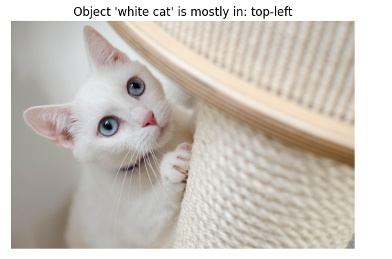
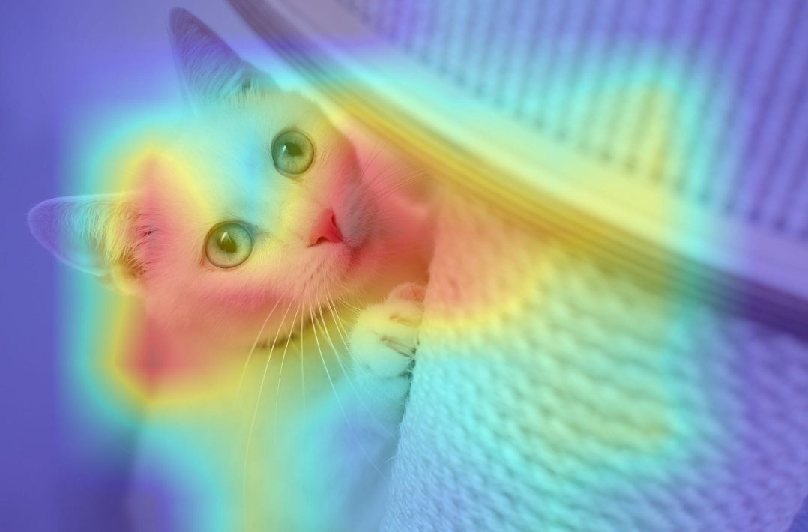

# CLIP-Powered Image Search & Explainable AI 🔍🖼️

This project implements an advanced image retrieval system using OpenAI's **CLIP** model, **ChromaDB** for vector storage, and **FastAPI** for serving. It goes beyond simple search by adding spatial reasoning and attention visualization.

## Key Features
- **Semantic Search:** Find images using natural language queries (e.g., "a white cat in the garden").
- **Vector Database:** Uses `ChromaDB` to index and store image embeddings for fast retrieval.
- **Spatial Reasoning:** Automatically detects which part of the image (Top-Left, Bottom-Right, etc.) best matches the text query.
- **Attention Maps (XAI):** Generates heatmaps using an occlusion-based approach to show exactly where the model is "looking" to find the object.
- **REST API:** Ready-to-use endpoints for searching and explaining model decisions.

## How It Works
1. **Indexing:** Images in the `data/` folder are processed by the CLIP Text/Image encoder and stored in a persistent local database.
2. **Search:** The `SentenceTransformer('clip-ViT-B-32')` converts your text query into a vector and finds the nearest neighbor in the DB.
3. **Explanation:** The system systematically masks parts of the image to calculate which regions contribute most to the similarity score.

## API Endpoints
- `GET /search?query=your+text`: Returns the best-matching images from the database.
- `POST /explain`: Upload an image and a text query to receive a heatmap JPG showing the object's location.

## Visualizations

| Spatial Reasoning | Attention Map (Heatmap) |
|---|---|
|  |  |

## Setup & Usage
1. Place your images in the `data/` folder.
2. Run your .ipynb file.
3. Access the API at `http://localhost:8000`.
