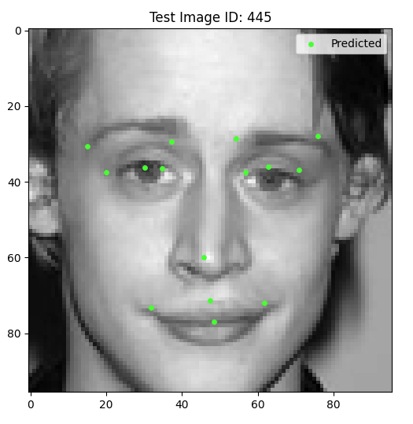

# Facial Keypoints Regression using CNN (PyTorch)

This project implements a Deep Learning system to automatically detect 15 key facial landmarks (eyes, nose, mouth) on 96x96 grayscale images. The problem is approached as a coordinate regression task using Convolutional Neural Networks.

## 📊 Performance Visualization

*Example of the model's prediction on a test image. Green marks represent the predicted coordinates.*

## 🚀 Key Features
- **Framework:** PyTorch 2.9+
- **Architecture:** 3-block Convolutional Neural Network (CNN).
- **Data Pipeline:** 
  - Custom `Dataset` class handling image parsing and landmark normalization.
  - Integration of modern `torchvision.transforms.v2` for image preprocessing.
  - Missing data handling (Mean Imputation / Masking).
- **Normalization:** Min-Max scaling for both images [0, 1] and coordinates [0, 1] to ensure stable convergence.

## 🧠 Model Architecture
The network consists of a feature extractor and a regression head:
1. **Conv Block 1:** `Conv2d` (32 filters) -> `ReLU` -> `MaxPool`
2. **Conv Block 2:** `Conv2d` (64 filters) -> `ReLU` -> `MaxPool`
3. **Conv Block 3:** `Conv2d` (128 filters) -> `ReLU` -> `MaxPool`
4. **Regressor:** `Flatten` -> `Linear` (128 units) -> `ReLU` -> `Linear` (30 output units for 15 x,y pairs)

## 🛠 Setup and Installation
1. Clone the repository:
   ```bash
   git clone github.com
   
2. Install dependencies:
bash
pip install -r requirements.txt

## 📂 Data Setup
Download the dataset from Kaggle Facial Keypoints Detection https://www.kaggle.com/competitions/facial-keypoints-detection/data .
Place training.csv and test.csv into the /data folder in the project root.

## 📈 Training Results
The model was trained using MSELoss and the Adam optimizer. It achieved a final Training Loss of approximately 1.00e-03, demonstrating high precision in landmark localization on the Kaggle test set.