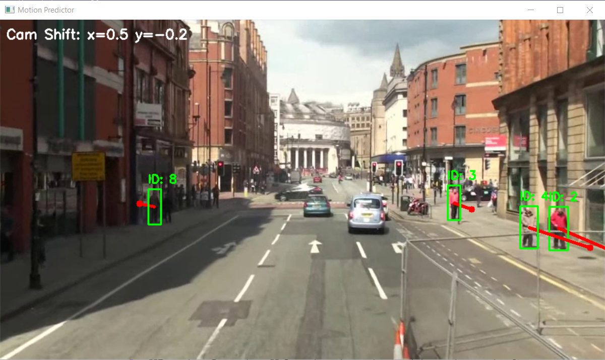

# Camera Ego-Motion Compensation & Trajectory Prediction

This project implements an advanced object tracking pipeline that compensates for camera movement (ego-motion) to accurately predict the future positions of moving people. It combines deep learning object detection with classic computer vision geometric tracking.

## Expected Output

Here is an example of the processed frame showcasing tracking IDs, calculated camera shift, and estimated future motion vectors:



## Core Features

*   **Object Detection:** Uses `YOLO11s` optimized to detect only the person class (`class 0`) with tuned confidence thresholds.
*   **Multi-Object Tracking:** Integrates `BYTETracker` (ByteTrack architecture) to maintain unique identities for pedestrians across frames even during partial occlusions.
*   **Ego-Motion Compensation (Lite SLAM approach):** Utilizes Lucas-Kanade Optical Flow (`cv2.calcOpticalFlowPyrLK`) and Shi-Tomasi corner detection (`cv2.goodFeaturesToTrack`) to compute frame-to-frame pixel shifts caused by camera translation.
*   **True Velocity Estimation:** Subtracts the estimated camera velocity vectors (`camera_dx`, `camera_dy`) from the raw tracker velocity metrics to find the absolute real-world directional speed of the subject.
*   **Trajectory Forecasting:** Projects and visualizes a future motion vector 30 frames ahead, rendering the prediction directly onto the video feed.

## File Requirements

To run the script/notebook successfully, place your source files inside the project root folder directory alongside the main script:
*   `2.webm` — The source video file with manual or automated camera movements.
*   `yolo11s.pt` — Pre-trained Ultralytics weights (will download automatically on the first run).

## Installation and Setup

Ensure you have all the required deep learning and computer vision libraries installed:

```bash
pip install ultralytics opencv-python numpy
```

Run the application, and a window titled "Motion Predictor" will appear. To stop execution and close the stream stream early, press the **'q'** key on your keyboard.
