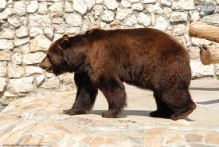
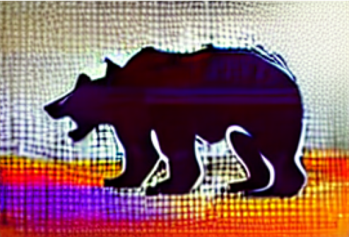
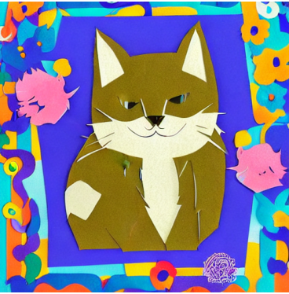

# Stable Diffusion Experiments

This subproject demonstrates text-to-image generation capabilities using **Stable Diffusion v1.5** via the Hugging Face `diffusers` library. It covers standard inference, structural guidance using ControlNet, and stylistic fine-tuning via LoRA adapters.

## Project Structure
*   `stable_diffusion_cpu.ipynb` – Basic text-to-image generation with step-by-step latent tracking.
*   `stable_diffusion_controlNet_cpu.ipynb` – Image-to-image generation preserving geometry using Canny edge detection.
*   `stable_diffusion_lora_cpu.ipynb` – Fine-tuned generation using low-rank adaptation for stylized outputs.

---

## 1. Vanilla Stable Diffusion Inference
Generates a high-resolution image directly from a text prompt using standard U-Net scheduling tracking.

*   **Prompt:** `"glass of red wine on a wrought iron table, studio lighting, high resolution"`
*   **Output Example:**
    ```markdown
    
    ```

## 2. ControlNet (Canny Edges)
Applies structural constraints to the generation process. It uses a reference image to extract edges, forcing the model to follow the specific composition of the source object.

*   **Prompt:** `"A silhouette of a bear made of bright flowers, texture of tulips and roses, hyperrealistic, 4k"`
*   **Conditioning Model:** `lllyasviel/sd-controlnet-canny`
*   **Output Example:**
    ```markdown

    | Source Image | Generated Output |
    |--------------|------------------|
    |  |  |
    ```

## 3. LoRA (Low-Rank Adaptation) Stylization
Leverages a lightweight parameter adapter to inject a specific artistic style into the frozen base model without high computational overhead.

*   **Prompt:** `"a cute fluffy cat, Paper_Cutting style, vibrant colors, soft studio lighting, high detail"`
*   **LoRA Weights:** `Kontext-Style/Paper_Cutting_lora`
*   **Output Example:**
    ```markdown
    
    ```

---

## Setup and Requirements

To run these scripts locally or in Google Colab, install the required dependencies:

```bash
pip install torch torchvision diffusers transformers accelerators opencv-python pillow matplotlib
```

*Note: The scripts are currently configured to run on `cpu`. For faster inference, update the device initialization line to `.to("cuda")` if a GPU is available.*
