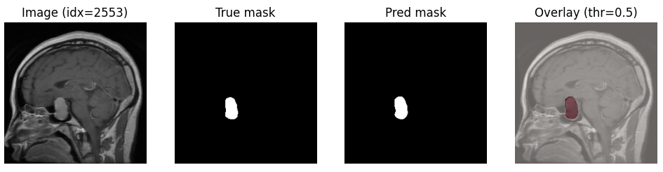

# Brain Tumor Segmentation using U-Net

This project implements a U-Net architecture for the semantic segmentation of brain tumors from medical imaging data.

 

## 🏗 Model Architecture

The model follows the classic U-Net structure with an Encoder-Decoder path and Skip Connections to preserve spatial information:

- **Encoder (Contracting Path):** 4 blocks of double $3 \times 3$ Convolutions, ReLU, and BatchNorm, followed by $2 \times 2$ Max Pooling. Filters increase: 64 → 128 → 256 → 512.
- **Bottleneck:** A dense feature extractor with 1024 filters.
- **Decoder (Expansive Path):** 4 blocks of $2 \times 2$ Transposed Convolutions and Skip Connections from the Encoder.
- **Output:** Final $1 \times 1$ Convolution layer for pixel-wise mask generation.

### Loss Function
We use a combined approach to ensure high accuracy:
- **Soft Dice Loss:** Specifically designed for handling class imbalance in medical images by maximizing the overlap between prediction and ground truth.
- **BCE (Binary Cross Entropy):** For pixel-level stability.

## 📊 Dataset

This project is designed to work with MRI brain scans (e.g., BraTS dataset or similar). The data should be organized as follows:

1. **Format:** Images and their corresponding masks should be in `.npy`, `.png`, or `.jpg` format.
2. **Source:** You can download the dataset from [Kaggle: Brain Tumor Segmentation](https://www.kaggle.com/datasets/nikhilroxtomar/brain-tumor-segmentation).
3. **Setup:**
   - Place raw images in `data/images/`.
   - Place ground truth masks in `data/masks/`.

```bash
Example structure:
data/
├── images/
└── masks/
```

## Getting Started

### Prerequisites
- Python 3.10+
- PyTorch (CUDA supported)
- Torchvision

### Installation
1. Clone the repository:
   ```bash
   git clone https://github.com
   cd Brain-Tumor-Segmentation-UNet
   ```

2. Install dependencies:
	bash
	pip install -r requirements.txt
	
## Training and Evaluation
The training script includes:
- Automatic Checkpointing: Saves the best model as best_model.tar based on the highest Dice Score.
- Validation Loop: Monitors val_loss and val_dice after each epoch.

## Releases and Pre-trained Weights
You can download the pre-trained weights (best_model.tar) from the Latest Releases section.
- This weights file includes:
- model_state: Parameters of the trained U-Net.
- best_dice: The best validation score achieved.

## Project Structure
- data/: Dataset storage (place your brain scans here).
- images/: Visualization samples and architecture diagrams.
- best_model.tar: Local storage for the best model weights.
	
