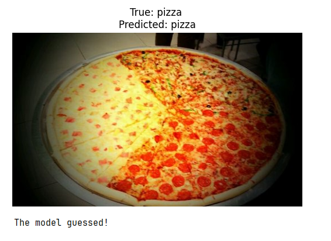

# ViT Image Classification: Pizza vs Cake 🍕🍰

This project demonstrates how to fine-tune a **Vision Transformer (ViT)** model for a binary classification task using the `google/vit-base-patch16-224-in21k` architecture and the Hugging Face `transformers` library.

## Project Overview
The goal is to distinguish between two food classes (**Pizza** and **Cake**) from the popular **Food101** dataset. The model is trained on a subset of images (500 per class) to show how efficiently ViT can adapt to new tasks even with limited data and CPU resources.

## Key Features
- **Dataset:** Food101 (filtered for specific classes).
- **Architecture:** Vision Transformer (ViT) pre-trained on ImageNet-21k.
- **Tools:** Hugging Face `Datasets`, `Transformers`, `Trainer` API, and `Evaluate`.
- **Training:** Optimized for CPU-only environments (FP16 disabled, `use_cpu=True`).
- **Visualization:** Includes a prediction script that displays the image with its true and predicted labels.

## How It Works
1. **Data Preprocessing:** Uses `ViTImageProcessor` and `torchvision.transforms` for resizing, normalization, and data augmentation (RandomResizedCrop, HorizontalFlip).
2. **Model Setup:** Replaces the classification head to match the number of target classes (2).
3. **Training:** Uses the `Trainer` API with early stopping logic (via `load_best_model_at_end`).

## Performance Visualization

*Example of the model correctly identifying a class from the test set.*

## Requirements
To run this specific example, you will need:
- `transformers`
- `datasets`
- `evaluate`
- `torch`
- `torchvision`
- `matplotlib`

*(Refer to the main `requirements.txt` in the root directory for full installation)*
