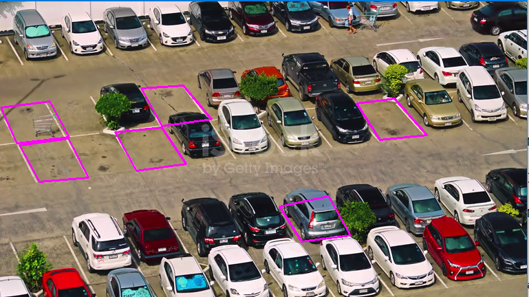
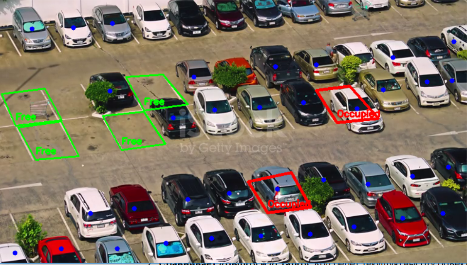

# AI Smart Parking Slot Detector 🚗🅿️

A computer vision-based system that monitors parking lot occupancy in real-time. The project combines manual region-of-interest (ROI) marking with deep learning detection to automate parking management.

## 🌟 Key Features
- **Custom ROI Tool:** Interactive polygon marking for parking slots using mouse events.
- **Deep Learning Detection:** Powered by **YOLO11** to detect cars, trucks, and motorcycles.
- **Dynamic Status Updates:** Real-time visual feedback (Green for "Free", Red for "Occupied").
- **Geometric Validation:** Uses point-in-polygon tests to ensure precise occupancy detection.

## 🛠 Tech Stack
- **Python 3.x**
- **Ultralytics YOLO11** (Object Detection)
- **OpenCV** (Image Processing & UI)
- **NumPy** (Coordinate Calculations)
- **Pickle** (Data Serialization)

## 📸 Screenshots

| Detection Process | Results |
| :---: | :---: |
|  |  |

## 🚀 How It Works
1. **Define Slots:** Run the markup script to click and define 4 points for each parking space. 
   - **Left Click:** Add a point.
   - **Right Click:** Remove the last defined slot.
   - Points are saved automatically to `slots.pkl`.
2. **Run Inference:** The main script loads the video and the saved coordinates.
3. **Analyze:** YOLO11 identifies vehicles, calculates their center points, and checks if they reside within the defined polygons.

## 📂 Project Structure
- `YOLO_detection.ipynb`: Main project notebook containing markup and detection logic.
- `slots.pkl`: Pre-saved coordinates for the parking layout.
- `result_1.png`, `result_2.png`: Visualization of the system in action.
- `parking_3.mp4`: Source video file (Sample).

## 🔧 Installation & Usage
1. Clone the repository:
   ```bash
   git clone https://github.com
   ```
2. Install dependencies:
   ```bash
   pip install ultralytics opencv-python numpy
   ```
3. Run the notebook cells to start detecting!

---
*Note: The YOLO11 weights (`yolo11s.pt`) will be automatically downloaded on the first run.*
