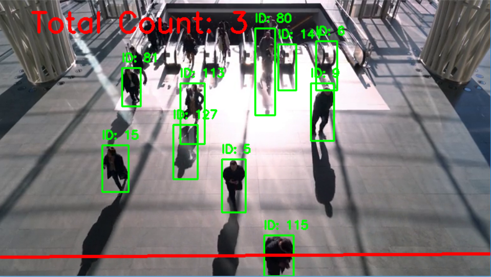

# AI People Counter with YOLO11 Tracking 🚶‍♂️📊

A computer vision application that detects and counts people crossing a virtual tripwire. The system uses a deep learning-based tracker to monitor individual movements and prevent double-counting.

## 🌟 Key Features
- **Custom Tripwire:** Interactive line drawing tool to set the "counting boundary" anywhere on the frame.
- **Robust Tracking:** Uses **YOLO11** state-of-the-art tracking (`model.track`) to maintain unique IDs for every person.
- **Directional Analysis:** Logic based on Y-coordinate history to detect when a person crosses the line from either direction.
- **Persistent Storage:** Saves the line configuration to a file, so you don't have to redraw it every time.

## 🛠 Tech Stack
- **Python 3.x**
- **Ultralytics YOLO11** (Detection & Tracking)
- **OpenCV** (Video Processing & UI)
- **Pickle** (Line Configuration Storage)

## 📸 Demo


## 🚀 How It Works
1. **Set the Line:** Run the first part of the script to draw a line on a static frame.
   - **Left Click:** Place two points to create a line.
   - **Right Click:** Reset the points.
   - Press **'q'** to save and exit.
2. **Inference & Counting:** 
   - The script loads the video and the `line_config.pkl`.
   - The model tracks each person and calculates their center point (`cx, cy`).
   - If a person's center moves from above the line to below (or vice-versa) between two frames, the counter increments.

## 📂 Project Structure
- `YOLO_tracking.ipynb`: Main notebook containing the drawing tool and the counting logic.
- `line_config.pkl`: File storing the $(x, y)$ coordinates of your counting line.
- `people.mp4`: Sample video for testing.
- `result.png`: Screenshot of the counting system in action.

## 🔧 Installation & Usage
1. Clone the repository:
   ```bash
   git clone https://github.com
   ```
2. Install dependencies:
   ```bash
   pip install ultralytics opencv-python
   ```
3. Open `YOLO_tracking.ipynb` and run the cells.

---
*Note: The YOLO11 Nano weights (`yolo11n.pt`) will be automatically downloaded during the first execution.*
